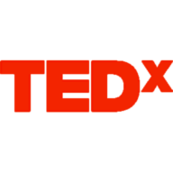
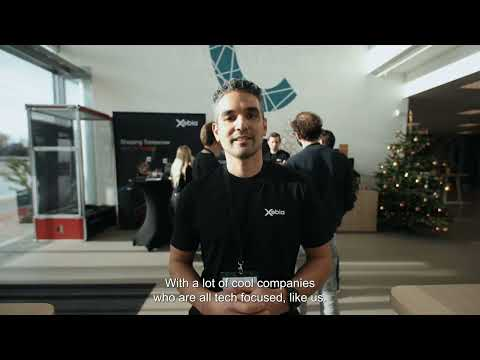
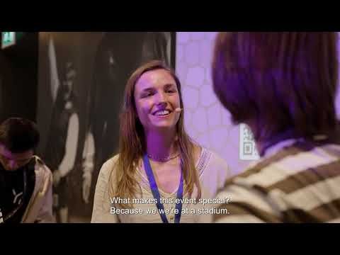
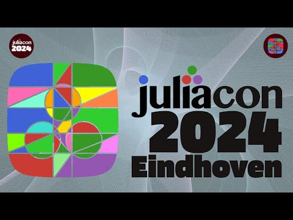
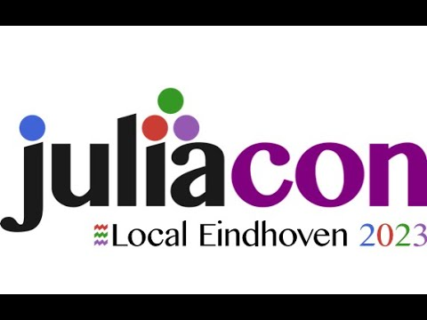
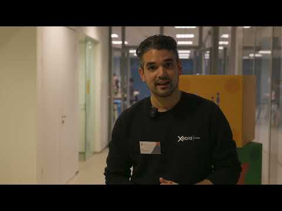

# Events Organized

Organizes and hosts recurring technical meetups across data, algorithms, Julia, cloud-native, and Java — all "no sales, no marketing, no recruiting" communities focused purely on technical exchange.

<a id="pydata-eindhoven" class="ev-chip" style="--ev-color:#00bfa5" href="https://www.meetup.com/pydata-eindhoven/" target="_blank" rel="noreferrer noopener">PyData EindhovenOrganizing Committee Chair &amp; Community Manager1,210 members · 4.7★ · €75k+ raised for OSS</a>
<a id="algosphere-eindhoven" class="ev-chip" style="--ev-color:#f9a825" href="https://www.meetup.com/algosphere/" target="_blank" rel="noreferrer noopener">AlgoSphere EindhovenLead Organizer357 members · 4.7★ · formerly MATLAB Coders</a>
<a id="julialang-eindhoven" class="ev-chip" style="--ev-color:#7c4dff" href="https://www.meetup.com/julialang-eindhoven/" target="_blank" rel="noreferrer noopener">JuliaLang EindhovenOrganizer362 members · 4.9★</a>
<a id="dutch-cloud-native-ai-community" class="ev-chip" style="--ev-color:#2e7bcf" href="https://www.meetup.com/dutch-cloud-native/" target="_blank" rel="noreferrer noopener">Dutch Cloud Native &amp; AI CommunityHost</a>
<a id="java-eindhoven" class="ev-chip" style="--ev-color:#e53935" href="https://luma.com/pb5zmwyk" target="_blank" rel="noreferrer noopener">JAVA EindhovenHost (with Marnix Kammer)</a>
<a id="playwright-netherlands" class="ev-chip" style="--ev-color:#2eab6d" href="https://luma.com/7xuqf1sj" target="_blank" rel="noreferrer noopener">Playwright NetherlandsHost</a>
<a id="foss4gnl" class="ev-chip" style="--ev-color:#6d4c41" href="https://foss4g.nl" target="_blank" rel="noreferrer noopener">FOSS4GNLModerator</a>
<a id="tedxeindhoven" class="ev-chip" style="--ev-color:#e62b1e" href="https://www.tedxeindhoven.nl" target="_blank" rel="noreferrer noopener">TEDxEindhovenSponsor Manager (part-time volunteer)</a>

2026

Jul 8–9, 2026 · Groningen

FOSS4GNL 2026

Free and Open Source Software for Geospatial — a two-day conference and workshop organized by OSGeo.nl and the Jantina Tammes School (RUG).

May 19, 2026 · Utrecht

 Playwright Evening @ ProRail

Free · 37 attendees · open-source testing with Playwright, "no sales, no marketing, no hiring, just technical talks"

Also spoke: <a href="talks.md#top-10-lessons-learnt-in-adopting-playwright">Top 10 Lessons Learnt in Adopting Playwright</a>

Mar 5, 2026 · High Tech Campus, Eindhoven

 JAVA and Performance

Hosted with Marnix Kammer, including a CGI introduction segment.

Jan 20, 2026 · ASML Building 7, Veldhoven

 Cloud Native @ASML: How to Scale Without Limits

2025

Dec 9, 2025 · Conference Center The Strip, HTC

 PyData Eindhoven 2025

23 talks across Data Engineering, AI &amp; ML, and Sport Analytics (with PySport).

<a class="yt-thumb" href="https://youtu.be/Mcbhyi_egCk" target="_blank" rel="noreferrer noopener">Aftermovie</a>

<a href="https://youtube.com/playlist?list=PLGVZCDnMOq0qE4NA_fkVLZABsRs8waMVC" target="_blank" rel="noreferrer noopener">Full 2025 talks playlist</a>

Nov 18, 2025

 PyData x Pipple Meetup

13 attendees · "The Power of Data and AI in Practice"

Oct 23, 2025 · Utrecht

 PyData Meetup @ BigData Republic

13 attendees.

Included Gareth's own talk: <a href="talks.md#getting-started-with-soccer-analytics">Getting Started with Soccer Analytics</a>

Sep 29, 2025 · ASML Global HQ, Veldhoven

 Cloud Native @ASML with Octopus: ArgoCD and More!

Jun 17, 2025 · ASML

 Julia x Rust Meetup Eindhoven

46 attendees · with RustNL

<ul>
<li>"Low-Level Shenanigans in a High-Level Language" — <a href="https://www.linkedin.com/in/tim-besard-6b766031/" target="_blank" rel="noreferrer noopener">Tim Besard</a>, JuliaHub</li>
<li>"What Actually Are Attributes?" — Jana Dönszelmann, Hexcat / RustNL</li>
<li>Panel discussion led by <a href="https://www.linkedin.com/in/jorge-vieyra-76280542/" target="_blank" rel="noreferrer noopener">Jorge Vieyra</a> (ASML) and Gareth Thomas (CGI)</li>
</ul>

Apr 2, 2025

 PyData Meetup @ Bright Cape

42 attendees · "Scalable AI &amp; Cloud Deployments"

Mar 25, 2025 · Sioux Labs

 Rust x Julia Meetup Eindhoven

17 attendees · with RustNL

<ul>
<li>"Julia in C World: Fast, Safe and Seamless" — Yury, ASML</li>
<li>"Rust and Julia, ¿por qué no los dos?" — Thomas, Vention</li>
<li>"Fearless Refactoring in Rust" — Martin, ROCSYS</li>
</ul>

2024

Oct 10, 2024 · Cafe 100 Watt, Stadsbrouwerij Eindhoven

 Challenges on Developing Real-Time Algorithms

46 attendees · sponsored by ASML

<ul>
<li>"20,000 Leagues Under MATLAB, Python and Julia: A Numerical Journey" — <a href="https://www.linkedin.com/in/jorge-vieyra-76280542/" target="_blank" rel="noreferrer noopener">Jorge Vieyra</a>, Julia Lead Engineer at ASML</li>
<li>"War Stories with Sensor Fusion" — <a href="https://www.linkedin.com/in/marcusdaviforte/" target="_blank" rel="noreferrer noopener">Marcus Forte</a>, System Architect at Vanderlande / Sioux</li>
<li>"Co-Design in Radio Astronomy, a Use Case in Fourier Domain Dedispersion" — Steven van der Vlugt, Researcher Computer Systems at ASTRON</li>
</ul>

Sep 10, 2024 · AI Innovation Center, HTC

 Cutting-Edge AI and Machine Learning Innovations, with Kickstart.ai

46 attendees.

Jul 11, 2024 · Philips Stadium

 PyData Eindhoven 2024

<a class="yt-thumb" href="https://youtu.be/M2LKrgDJ0Y8" target="_blank" rel="noreferrer noopener">Aftermovie</a>

<a href="https://youtube.com/playlist?list=PLGVZCDnMOq0q7a2aoNP1au_1egfZEjGL6" target="_blank" rel="noreferrer noopener">Full 2024 talks playlist</a>

Jul 9, 2024 · Philips Stadium, Eindhoven

We Will Be at JuliaCon 2024!

7 attendees · the 11th annual JuliaCon, held in Eindhoven and organized alongside the local Julia community.

<a class="yt-thumb" href="https://youtu.be/8yxvoTsd3o0" target="_blank" rel="noreferrer noopener">Aftermovie</a>

<a href="https://youtube.com/playlist?list=PLP8iPy9hna6R5gUZLbSZCZTGJ0uncLBfi" target="_blank" rel="noreferrer noopener">Full talks playlist — The 11th Annual JuliaCon</a> · Also gave <a href="talks.md#matlab-julia">MATLAB → Julia</a>

Mar 28, 2024 · HTC 60, hosted by NXP

 Effective Strategies for Optimizing Cloud Costs, with Eindhoven Data Community

Mar 6, 2024

 Numerical Modeling with Julia @ Deltares

50 attendees.

<ul>
<li>"Using Julia for Portable GPU Programming" — <a href="https://www.linkedin.com/in/tim-besard-6b766031/" target="_blank" rel="noreferrer noopener">Tim Besard</a>, JuliaHub</li>
<li>"Hydrological Modelling in Julia with Ribasim" — Huite Bootsma, Deltares</li>
<li>"Finite Element Modeling of Assets in Future Distribution Grids Using Julia" — Domenico Lahaye, TU Delft</li>
</ul>

2023

Dec 1, 2023 · High Tech Campus

JuliaCon Local Eindhoven 2023

8 attendees.

<a class="yt-thumb" href="https://youtu.be/9YfRd6sdI4Q" target="_blank" rel="noreferrer noopener">Aftermovie</a>

Nov 30, 2023

 PyData Eindhoven 2023

<a class="yt-thumb" href="https://youtu.be/9X15giuZ4-g" target="_blank" rel="noreferrer noopener">Aftermovie</a>

<a href="https://youtube.com/playlist?list=PLGVZCDnMOq0qkbJjIfppGO44yhDV2i4gR" target="_blank" rel="noreferrer noopener">Full 2023 talks playlist</a>

Nov 21, 2023 · HTC Building 5

MATLABers Unite @ High Tech Campus

13 attendees.

<ul>
<li>"Making Your MATLAB Code Ready for Deployment Using C++ Code Generation" — <a href="https://www.linkedin.com/in/comelissant/" target="_blank" rel="noreferrer noopener">Co Melissant</a>, CTO &amp; Senior Consultant</li>
<li>"My Favourite New Features in MATLAB R2023a and R2023b" — Gareth Thomas</li>
</ul>

Own talk: <a href="talks.md#my-favourite-new-features-in-matlab-r2023a-and-r2023b">My Favourite New Features in MATLAB R2023a and R2023b</a>

Sep 28, 2023 · ALTEN / High Tech Campus

Positioning Julia &amp; Free Workshop: Interactive Web Apps in Julia with Genie

38 attendees (talks) · 15 attendees (workshop)

<ul>
<li>"Interactive Data Dashboards with Genie: Design to Deployment" — <a href="https://www.linkedin.com/in/pere-gim%C3%A9nez-febrer-678235129/" target="_blank" rel="noreferrer noopener">Pere Giménez</a>, Genie</li>
<li>"Easiness of Algorithm Deployment" — <a href="https://www.linkedin.com/in/evangelos-paradas/" target="_blank" rel="noreferrer noopener">Evangelos Paradas</a>, ASML</li>
<li>"Julia's Rise in the TIOBE Index" &amp; "Code Quality Checkers in Julia" — <a href="https://www.linkedin.com/in/paul-jansen-299429/" target="_blank" rel="noreferrer noopener">Paul Jansen</a>, TIOBE</li>
</ul>

Sep 5, 2023 · Veghel

 PyData Meetup @ Vanderlande: ML Automation in the Logistics Domain

65 attendees.

May 25, 2023 · Veghel

 PyData Meetup @ Jumbo: Solving Business Problems with Python

52 attendees.

Apr 26, 2023

 PyData Meetup @ Prodrive Technologies

39 attendees · "Python and Mechatronics"

Mar 2, 2023 · Eindhoven

 Python with Purpose @ Pipple

56 attendees.

Jan 26, 2023 · Aarle-Rixtel

 PyData Meetup: Demand Forecasting and Logistic Optimization @ EyeOn

38 attendees.

2022

Dec 2, 2022 · HTC

 PyData Eindhoven Conference

Ticket proceeds donated to NumFOCUS.

<a class="yt-thumb" href="https://youtu.be/by8HA__fWKs" target="_blank" rel="noreferrer noopener">Aftermovie</a>

Oct 25, 2022 · Eindhoven

 PyData Automotive Meetup @ DAF

58 attendees.

Jul 21, 2022 · HTC 5

 PyData Eindhoven Meetup — Back to Face-to-Face Meetups

Hosted by VersionBay.

2019 – 2021

2019 – 2021 · Eindhoven area &amp; online

11 Further MATLAB Coders Meetups

In person around Eindhoven (Sioux, Avular, ICT, ALTEN) and online through the pandemic — including several "What's New in MATLAB" release talks.

<a href="talks.md#whats-new-in-matlab-release-talks">"What's New in MATLAB" Release Talks</a> · Founded as <a href="hobbies.md#matlab-coders">MATLAB Coders</a>, May 2019

