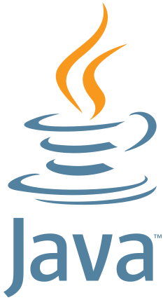

# Events Organized

Organizes and hosts recurring technical meetups across data, algorithms, Julia, cloud-native, and Java — all "no sales, no marketing, no recruiting" communities focused purely on technical exchange.

## { width="40" } PyData Eindhoven

**Organizing Committee Chair & Community Manager** · Jan 2020 – Present · 6 yrs 7 mo · Eindhoven Area, Netherlands :flag_nl:

1,210 members · 4.7★ (110 ratings) · part of the global PyData network (98 groups), with NumFOCUS, Inc. as super organizer. Leads the group alongside 10 other organizers, promoting best practices in data management, processing, analytics, and visualization with Python, Julia, and R.

- PyData Eindhoven 2025 — Dec 9, 2025
- PyData Meetup @ Bright Cape — Apr 2, 2025 · 42 attendees

**Talk playlists:** [2025](https://youtube.com/playlist?list=PLGVZCDnMOq0qE4NA_fkVLZABsRs8waMVC){ target=_blank rel="noreferrer noopener" } ·
[2024](https://youtube.com/playlist?list=PLGVZCDnMOq0q7a2aoNP1au_1egfZEjGL6){ target=_blank rel="noreferrer noopener" } ·
[2023](https://youtube.com/playlist?list=PLGVZCDnMOq0qkbJjIfppGO44yhDV2i4gR){ target=_blank rel="noreferrer noopener" }

**Aftermovies:** [2025](https://youtu.be/Mcbhyi_egCk){ target=_blank rel="noreferrer noopener" } ·
[2024](https://youtu.be/M2LKrgDJ0Y8){ target=_blank rel="noreferrer noopener" } ·
[2023](https://youtu.be/9X15giuZ4-g){ target=_blank rel="noreferrer noopener" } ·
[2022](https://youtu.be/by8HA__fWKs){ target=_blank rel="noreferrer noopener" }

[meetup.com/pydata-eindhoven](https://www.meetup.com/pydata-eindhoven/){ target=_blank rel="noreferrer noopener" }

## { width="40" } AlgoSphere Eindhoven

**Lead Organizer** · Eindhoven Area, Netherlands :flag_nl:

357 members · 4.7★ (46 ratings). *"Algorithm Excellence, Shared Experience"* — a sales-free technical community for algorithm development across MATLAB, Python, Julia, Rust, and more, with 6 other organizers. Formerly **MATLAB Coders** (founded May 2019, see the [MATLAB Coders venture](experience.md#entrepreneurial-ventures)), rebranded AlgoSphere Eindhoven to reflect its broader, language-agnostic focus.

- **Challenges on Developing Real-Time Algorithms** — Oct 10, 2024 · Cafe 100 Watt, Stadsbrouwerij Eindhoven · 46 attendees · sponsored by ASML
    - "20,000 Leagues Under MATLAB, Python and Julia: A Numerical Journey" — Jorge Vieyra, Julia Lead Engineer at ASML
    - "War Stories with Sensor Fusion" — Marcus Forte, System Architect at Vanderlande / Sioux
    - "Co-Design in Radio Astronomy, a Use Case in Fourier Domain Dedispersion" — Steven van der Vlugt, Researcher Computer Systems at ASTRON
- **MATLABers Unite @ High Tech Campus** — Nov 21, 2023 · HTC Building 5 · 13 attendees
    - "Making Your MATLAB Code Ready for Deployment Using C++ Code Generation" — Co Melissant, CTO & Senior Consultant
    - "My Favourite New Features in MATLAB R2023a and R2023b" — Gareth Thomas
- 11 further MATLAB Coders meetups, 2019–2021, in person around Eindhoven (Sioux, Avular, ICT, ALTEN) and online through the pandemic — including several "What's New in MATLAB" release talks by Gareth, see [Talks Given](talks.md)

[meetup.com/algosphere](https://www.meetup.com/algosphere/){ target=_blank rel="noreferrer noopener" }

## { width="60" } JuliaLang Eindhoven

**Organizer** · Eindhoven Area, Netherlands :flag_nl:

362 members · 4.9★ (34 ratings), with 6 other organizers. A place for people passionate about Julia to share experiences in the Eindhoven region — no sales, no marketing, no recruiting, just technical people solving technical problems.

- **Julia x Rust Meetup Eindhoven** — Jun 17, 2025 · ASML · 46 attendees · with RustNL
    - "Low-Level Shenanigans in a High-Level Language" — Tim Besard, JuliaHub
    - "What Actually Are Attributes?" — Jana Dönszelmann, Hexcat / RustNL
    - Panel discussion led by Jorge Vieyra (ASML) and Gareth Thomas (CGI)
- **Rust x Julia Meetup Eindhoven** — Mar 25, 2025 · Sioux Labs · 17 attendees · with RustNL
    - "Julia in C World: Fast, Safe and Seamless" — Yury, ASML
    - "Rust and Julia, ¿por qué no los dos?" — Thomas, Vention
    - "Fearless Refactoring in Rust" — Martin, ROCSYS
- **We will be at JuliaCon 2024!** — Jul 9, 2024 · Philips Stadium, Eindhoven · 7 attendees
- **Numerical Modeling with Julia @ Deltares** — Mar 6, 2024 · 50 attendees
    - "Using Julia for Portable GPU Programming" — Tim Besard, JuliaHub
    - "Hydrological Modelling in Julia with Ribasim" — Huite Bootsma, Deltares
    - "Finite Element Modeling of Assets in Future Distribution Grids Using Julia" — Domenico Lahaye, TU Delft
- **JuliaCon Local Eindhoven 2023** — Dec 1, 2023 · High Tech Campus · 8 attendees
- **Positioning Julia** — Sep 28, 2023 · ALTEN · 38 attendees
    - "Interactive Data Dashboards with Genie: Design to Deployment" — Pere Giménez, Genie
    - "Easiness of Algorithm Deployment" — Evangelos Paradas, ASML
    - "Julia's Rise in the TIOBE Index" & "Code Quality Checkers in Julia" — Paul Jansen, TIOBE
- **Free Workshop: Interactive Web Apps in Julia with Genie** — Sep 28, 2023 · High Tech Campus · 15 attendees

JuliaCon 2024 — the 11th annual JuliaCon — was held in Eindhoven, organized alongside the local Julia community:

- [Full talks playlist — The 11th Annual JuliaCon (Eindhoven)](https://youtube.com/playlist?list=PLP8iPy9hna6R5gUZLbSZCZTGJ0uncLBfi){ target=_blank rel="noreferrer noopener" }
- [JuliaCon 2024 aftermovie](https://youtu.be/8yxvoTsd3o0){ target=_blank rel="noreferrer noopener" }
- [JuliaCon Local Eindhoven 2023 aftermovie](https://youtu.be/9YfRd6sdI4Q){ target=_blank rel="noreferrer noopener" }

[meetup.com/julialang-eindhoven](https://www.meetup.com/julialang-eindhoven/){ target=_blank rel="noreferrer noopener" }

## { width="70" } Dutch Cloud Native & AI Community

**Host** · Netherlands :flag_nl:

Co-hosts recurring evening events at ASML, pairing external speakers with networking and food.

- Cloud Native @ASML with Octopus: ArgoCD and more! — Sep 29, 2025 · ASML Global HQ, Veldhoven
- Cloud Native @ASML: How to scale without limits — Jan 20, 2026 · ASML Building 7, Veldhoven

[meetup.com/dutch-cloud-native](https://www.meetup.com/dutch-cloud-native/){ target=_blank rel="noreferrer noopener" }

## { width="30" } JAVA Eindhoven

**Host** (with Marnix Kammer) · Eindhoven Area, Netherlands :flag_nl:

- JAVA and Performance — Mar 5, 2026 · High Tech Campus, Eindhoven · with a CGI introduction segment

[luma.com/pb5zmwyk](https://luma.com/pb5zmwyk){ target=_blank rel="noreferrer noopener" }

## FOSS4GNL

**Moderator** · Groningen, Netherlands :flag_nl:

FOSS4GNL 2026 — Free and Open Source Software for Geospatial — a two-day conference and workshop event organized by OSGeo.nl and the Jantina Tammes School (RUG), Jul 8–9, 2026, in Groningen.

[foss4g.nl](https://foss4g.nl){ target=_blank rel="noreferrer noopener" }
