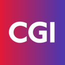
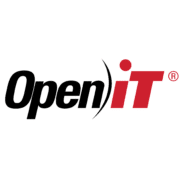

# Experience

Twenty years spanning engineering, technical sales, entrepreneurship, and consulting — with three companies built or led as country manager along the way.

## { width="40" } CGI Nederland

**Consultant** · Jan 2026 – Present · Eindhoven Area, Netherlands :flag_nl:

Supporting delivery and consulting work in the Eindhoven area.

- **ProRail** — Front-end Tester and Architect for [railmaps.nl](https://www.railmaps.nl).

**Director Consulting Services** · Mar 2025 – Feb 2026 · 1 yr · Eindhoven Area, Netherlands :flag_nl:

Directed consulting delivery and service growth on rejoining CGI, ahead of moving into a hands-on Consultant role. Managed a team of 17 people across the Eindhoven region, against a sales target of over €4M.

- **ASML** — Worked as Senior Consultant, leading the migration from Subversion to Git for hundreds of developers.

[cgi.com/nl/en](https://www.cgi.com/nl/en){ target=_blank rel="noreferrer noopener" }

## Entrepreneurial ventures

*Nov 2018 – Mar 2025 · 6 yrs 5 mo · Eindhoven Area, Netherlands :flag_nl:*

Ran three ventures at once between 2019 and 2021 — VersionBay, MATLAB Coders, and Open iT's Benelux territory.

=== "{ width='20' } VersionBay — Co-Founder"

    **Nov 2018 – Mar 2025 · 6 yrs 5 mo**

    Co-founded and ran the company for six and a half years, empowering people to leverage state-of-the-art software stacks.

    Client assignments:

    - **ASML** — Regression testing.
    - **DNB** (De Nederlandsche Bank) — Financial modeling and application deployment.
    - **ESA** (European Space Agency) — Updating Simulink models to newer versions.

    Also built VersionBay's own training content and products: **Toolbox Usage Analyzer**, for measuring MATLAB usage, and **Package Tester**, which automatically generates regression tests while migrating from older MATLAB versions to newer ones — with automatic pipeline generation to pinpoint effort and where new MATLAB/Simulink versions caused migration work.

    [versionbay.com](https://versionbay.com/){ target=_blank rel="noreferrer noopener" }

=== "MATLAB Coders — Founder"

    **May 2019 – Aug 2024 · 5 yrs 4 mo**

    Founded and ran a second venture in parallel with VersionBay for over five years, focused on the MATLAB developer community.

=== "{ width='20' } Open iT, Inc. — Country Manager Benelux"

    **Jan 2020 – Sep 2021 · 1 yr 9 mo**

    Ran the Benelux territory for Open iT, giving companies visibility into actual usage of their engineering software assets.

## { width="40" } MathWorks

*Jan 2009 – Sep 2018 · 9 yrs 9 mo*

=== "Business Development Manager"

    **Jan 2017 – Sep 2018 · 1 yr 9 mo · Eindhoven Area, Netherlands :flag_nl:**

    Led definition and execution of MathWorks' global Academic strategy, partnering with universities worldwide to grow MATLAB and Simulink adoption in teaching, learning, and research — capping 8+ years at the company that started as an application engineer in embedded code generation.

    Collaborated with Arduino to drive the Engineering Kit that Arduino used to offer, and helped create the MathWorks Academia keynote — delivered alongside the main company keynote — two years running.

=== "Industry Manager – Education"

    **Jan 2014 – Jan 2017 · 3 yrs 1 mo**

    Guided business planning, marketing, and sales strategy for the global Education market, directing sales/services teams and driving awareness of MathWorks technology across academic institutions worldwide.

=== "Senior Application Engineer"

    **May 2012 – Dec 2013 · 1 yr 8 mo**

    Acted as technical lead and customer advocate on key accounts, running public and private technical events, supporting complex sales evaluations, and feeding customer insight back into product development.

=== "Application Engineer"

    **Jan 2009 – Apr 2012 · 3 yrs 4 mo**

    Demonstrated MathWorks tools through hands-on customer engagements centred on rapid prototyping, automatic code generation, and code verification/validation, including deploying MATLAB into .NET and Java environments.

Also helped drive, organize, and moderate the MathWorks Research Summit for three years.

A strong believer in and promoter of MathWorks' support for RoboCup — volunteering at the University-level competition in 2001, then driving MathWorks' backing of RoboCup over the following years.

Visited and worked with several companies and institutions across the MathWorks years, giving presentations and demos and helping teams put MATLAB and Simulink to work: ESA, CNH, ASML, VDL, Punch, TU/e, and TU Delft. Also worked with KROHNE in the Netherlands, visited the LEGO HQ in Denmark, and worked with Lely, Belfius (Belgium), Goodyear (Luxembourg), and Toyota (Luxembourg), among others.

Gave talks at top engineering universities in Israel, Turkey, Greece, Hungary, and South Africa, and visited universities in Japan. Connected with commercial companies in Turkey on Code Generation, Verification & Validation, DO-178B/C, and ISO standards, and how to leverage HIL simulations to achieve certification. Gave guest lectures at TU Eindhoven, TU Delft, and Fontys Eindhoven, and supported MathWorks distributors in driving their regional Education strategy.

Still an active member of the MATLAB Central community since 2011 — rank 549 of 301,994, 70 Answers contributed, 3 files published, and 2,608 total downloads.

[mathworks.com](https://www.mathworks.com/){ target=_blank rel="noreferrer noopener" } ·
[MATLAB Central profile](https://nl.mathworks.com/matlabcentral/profile/authors/1662033){ target=_blank rel="noreferrer noopener" }

## { width="40" } Oceanscan

**Software Engineer** · Jan 2007 – Dec 2008 · 2 yrs · Scotland :scotland:

Delivered system integration from sonar GUIs to acoustic signal-processing algorithms, working across mechanical, electrical, and software teams, with systems testing as a core responsibility.

[oceanscan.com](https://www.oceanscan.com/){ target=_blank rel="noreferrer noopener" }

## { width="90" } Altran CIS

**Consultant** · Dec 2005 – Dec 2006 · 1 yr 1 mo · Portugal :flag_pt:

Contributed to design, implementation, and testing on a large-scale telecom access-network project, including redundancy coding to meet carrier coding standards. Also served as innovation officer, leading a five-person creative team on-site at client Nokia Siemens.

[altran.com](https://www.altran.com/){ target=_blank rel="noreferrer noopener" }
