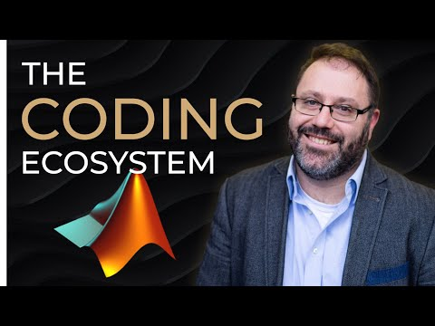
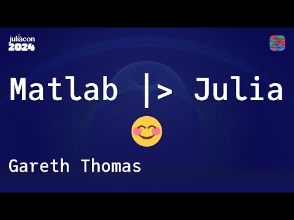

# Talks Given

A full history of conference talks, meetup sessions, and podcast guest appearances — most recent first.

2026

May 19, 2026 · Playwright Evening @ ProRail · Utrecht, Netherlands 

 Top 10 Lessons Learnt in Adopting Playwright

Delivered as Tester at CGI/ProRail. At ProRail, multiple teams use Playwright but each goes through similar adoption challenges — this talk shared best practices to accelerate that adoption, at a "no sales, no marketing, no hiring, just technical talks" community event.

<a href="https://luma.com/7xuqf1sj" target="_blank" rel="noreferrer noopener">View event on Luma</a>

2025

Oct 23, 2025 · PyData Meetup @ BigData Republic · Utrecht, Netherlands 

 Getting Started with Soccer Analytics

A live-coding session on soccer analytics with mplsoccer and StatsBomb data, showing how the sporting world tracks its data and how others can contribute to the open-source projects behind it.

<a href="assets/getting-started-with-soccer-analytics.pdf">View slides (PDF)</a>

Mar 20, 2025 · 040Coders · Eindhoven, Netherlands 

 The First 10 Hours: Moving from MATLAB to Julia

Presented as VersionBay founder — four practical examples of an experienced MATLAB developer's first steps in Julia: 2D/3D plotting, reading external files and working with tables, step response of a control system, and testing and developing a Julia package.

<a href="https://040coders.nl/abstracts/2025-03-Gareth-Thomas.shtml" target="_blank" rel="noreferrer noopener">View abstract</a>

Feb 26, 2025 · Podcast guest appearance

The Engineered-Mind Podcast — #147: MATLAB vs. Python vs. Julia: The Hidden Truths

Guest appearance discussing software versioning and language transitions across MATLAB, Python, and Julia, with practical examples from automotive, aerospace, and finance, plus code generation, AI integration, and DevOps. With host <a href="https://www.linkedin.com/in/jousefmurad/" target="_blank" rel="noreferrer noopener">Jousef Murad</a>.

<a class="yt-thumb" href="https://www.youtube.com/watch?v=Aa5VbiWUyts" target="_blank" rel="noreferrer noopener">Watch</a>

<a href="https://www.engineered-mind.com/podcast/matlab-vs-python-vs-julia-the-hidden-truths-gareth-thomas-podcast-147/" target="_blank" rel="noreferrer noopener">Read/listen</a> · <a href="https://www.youtube.com/watch?v=Aa5VbiWUyts" target="_blank" rel="noreferrer noopener">Watch on YouTube</a> · <a href="https://creators.spotify.com/pod/profile/jousef-murad/episodes/MATLAB-vs--Python-vs--Julia-The-Hidden-Truths---Gareth-Thomas--Podcast-147-e2vdsag" target="_blank" rel="noreferrer noopener">Listen on Spotify</a>

2024

Aug 29, 2024 · LinkedIn Live Webinar

 Testing with MATLAB

A webinar on testing practices with MATLAB, hosted live on LinkedIn.

<a href="assets/testing-with-matlab.pdf">View slides (PDF)</a> · <a href="https://www.linkedin.com/event/manage/7228740232450314240/" target="_blank" rel="noreferrer noopener">View event on LinkedIn</a>

Jul 2024 · JuliaCon 2024 · Eindhoven, Netherlands 

 MATLAB → Julia

Talk on moving from MATLAB to Julia, given at JuliaCon 2024 and published on the official Julia Programming Language YouTube channel.

<a class="yt-thumb" href="https://www.youtube.com/live/3y5yN7U0HCI" target="_blank" rel="noreferrer noopener">Watch</a>

<a href="https://www.youtube.com/live/3y5yN7U0HCI" target="_blank" rel="noreferrer noopener">Watch on YouTube</a>

May 11, 2024 · Podcast guest appearance

 ArrayCast — Episode 79: MATLAB

Guest panelist alongside fellow former MathWorks colleagues Steve Wilcockson and David Bergstein, discussing MATLAB's history, design philosophy, and place in the scientific computing ecosystem — from Cleve Moler's original matrix algebra system to Julia and the "two-language problem."

<a href="https://www.arraycast.com/2024/05/11/MATLAB.html" target="_blank" rel="noreferrer noopener">Listen on arraycast.com</a>

Apr 11, 2024 · Barcelona Julia Meetup · Norrsken House, Barcelona, Spain

 From MATLAB to Julia: Learnings

Shared four projects undertaken to get up to speed with Julia — the challenges and discoveries from the first 10 hours coming from a MATLAB background — alongside <a href="https://www.linkedin.com/in/jorge-vieyra-76280542/" target="_blank" rel="noreferrer noopener">Jorge Vieyra</a> (ASML) on "ASML's Julia Journey" and <a href="https://www.linkedin.com/in/pere-gim%C3%A9nez-febrer-678235129/" target="_blank" rel="noreferrer noopener">Pere Giménez</a> (Genie) on "A Beginner's Introduction to Julia."

<a href="https://www.meetup.com/cf1f2156-154f-4b84-80db-295496535ead/events/299573017/" target="_blank" rel="noreferrer noopener">View event on Meetup</a>

2024 · Technical Computing Camp 2024 · Hotel Rakovec, Brno Dam, Czech Republic

 Leveraging GitHub as a MATLAB User

Presented as VersionBay founder, at HUMUSOFT's 11th annual Technical Computing Camp — a case study on using GitHub for developing, testing, and distributing a MATLAB application.

<a href="assets/Leveraging%20GitHub%20for%20MATLAB%20Users.pdf">View slides (PDF)</a> · <a href="https://www.humusoft.com/archive/tcc2024/" target="_blank" rel="noreferrer noopener">View event on humusoft.com</a>

2023

Nov 21, 2023 · MATLABers Unite @ High Tech Campus · Eindhoven, Netherlands 

My Favourite New Features in MATLAB R2023a and R2023b

Eight hands-on demos of the newest MATLAB features, aimed at both newcomers and seasoned developers, with honest takes on when each feature is actually useful.

2019 – 2021

2019 – 2023 · AlgoSphere / MATLAB Coders meetups · Eindhoven, Netherlands 

"What's New in MATLAB" Release Talks

A recurring talk given at nearly every MATLAB release, walking the community through the newest features — in person and, through the pandemic, online: R2019a (May 2019, HTC), R2019b (Oct 2019, ICT), R2020a (Apr 2020, online), R2020b (Oct 2020, online), and R2021a (May 2021, online).

Dec 10, 2019 · Data Science Utrecht · Utrecht, Netherlands 

 First Steps in Reinforcement Learning Using MATLAB

Presented alongside a talk on Explainable AI in Healthcare, introducing the fundamentals of reinforcement learning and how to get started with it in MATLAB.

<a href="assets/first-steps-reinforcement-learning-matlab.pdf">View slides (PDF)</a> · <a href="https://www.meetup.com/data-science-utrecht/events/266562697/" target="_blank" rel="noreferrer noopener">View event on Meetup</a>

2015

Sep 2015 · MathWorks

 MATLAB and Simulink Racing Lounge: How to Make Your Simulink Experience More Productive

Productivity tips for Simulink users — Quick Typing for faster model creation, Fast Restart and JIT-compiled simulation, the Data Inspector, model variants, and file comparison tools. With Christoph Hahn.

<a href="https://nl.mathworks.com/videos/matlab-and-simulink-racing-lounge-how-to-make-your-simulink-experience-more-productive-107548.html" target="_blank" rel="noreferrer noopener">Watch on mathworks.com</a>

MathWorks years (undated)

MathWorks years · date unknown

Using MATLAB with Hardware-in-the-Loop

Technical talk on hardware-in-the-loop testing with MATLAB and Simulink, delivered during the MathWorks years.

<a href="assets/using-matlab-with-hardware-in-the-loop.pdf">View slides (PDF)</a>

